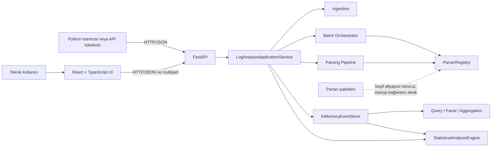
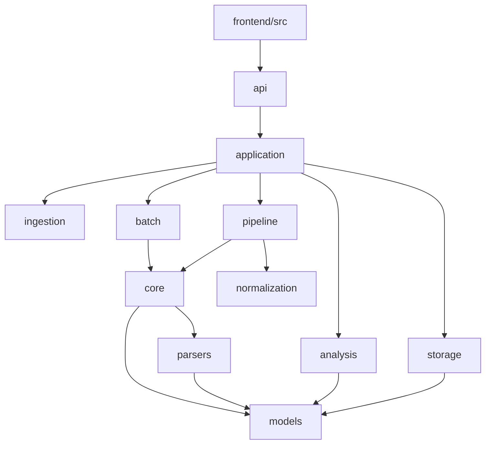
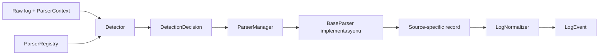
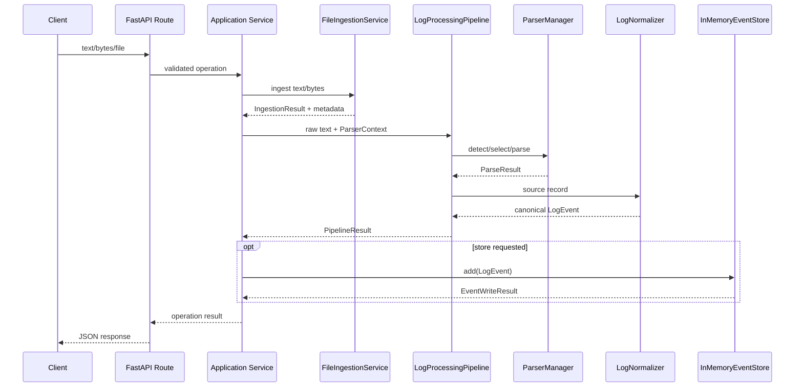
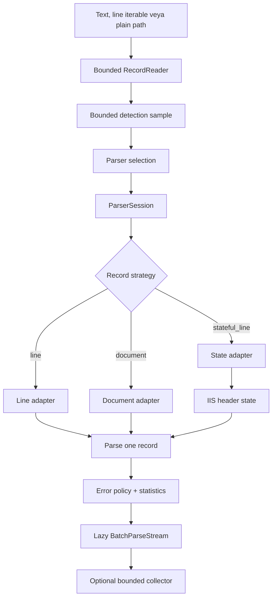
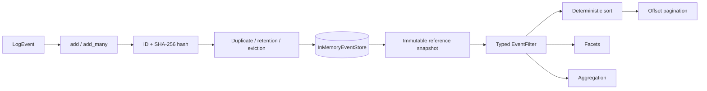
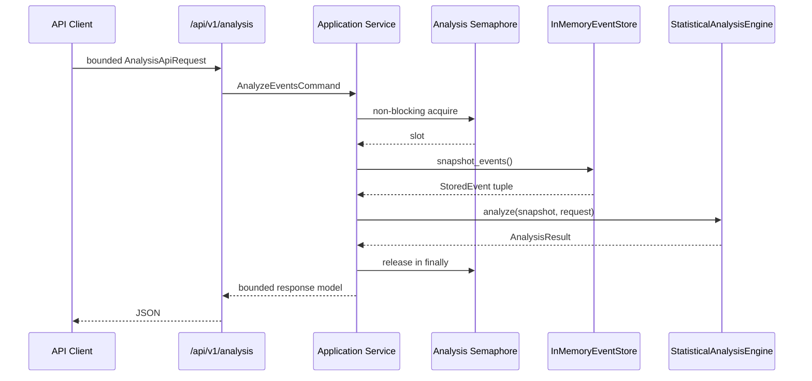
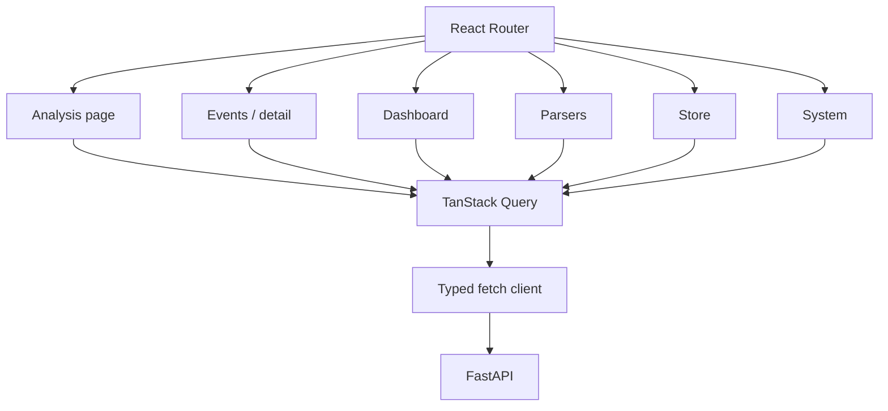
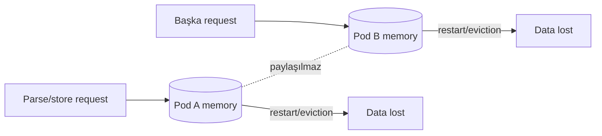
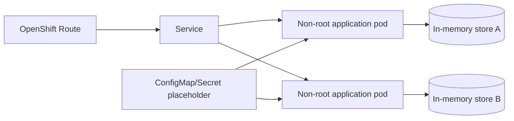

# Parsel Engine Mimarisi

Son güncelleme: 25 Temmuz 2026  
Referans commit: `64d604c`

## Kapsam

Parsel Engine; metin, byte, dosya ve arşiv kaynaklarını alan, log formatını
seçen, canonical `LogEvent` üreten, eventleri bellekte tutan, typed sorgular ve
istatistiksel analizler çalıştıran bir log analiz platformudur.

Bu belge mevcut kodu anlatır. Planlanan ancak henüz uygulanmamış bileşenler
açıkça “planlanan” olarak işaretlenir.

## Mimari invariants

- Aktif storage `InMemoryEventStore`'dur.
- SQL, ORM veya harici kalıcı veri tabanı yoktur.
- Veri process/pod-local ve geçicidir.
- Canonical model sınırı `LogEvent`'tir.
- Parser seçimi ile parser implementasyonu ayrıdır.
- HTTP katmanı application service üzerinden backend subsystemlerine erişir.
- Statistical analysis, immutable `StoredEvent` snapshotı üzerinde çalışır ve
  store'u değiştirmez.
- UI backend parser veya analysis algoritmalarını yeniden uygulamaz.
- Raw log, credential ve kimlik alanları varsayılan olarak metric label veya
  analiz group alanı değildir.

## Sistem bağlamı



## Katmanlar ve dependency yönü



Alt katmanların FastAPI veya React tiplerine bağımlı olmaması beklenir.
Application service HTTP request/response tiplerini değil domain/application
modellerini kullanır.

## Modül sorumlulukları

| Modül | Gerçek sorumluluk | Durum notu |
|---|---|---|
| `models` | Canonical event, parse, batch, query, store ve analysis modelleri | Bazı enum ve eski test sözleşmeleri uyuşmuyor |
| `core` | BaseParser, context, registry, manager ve detection | Ana sözleşmeler mevcut |
| `plugins` | Package ve entry-point aday keşfi/yüklemesi | Application startup'a bağlı değil |
| `parsers` | IIS, JSON, Redis, webserver, syslog ve Windows XML parserları | Redis regresyonları açık |
| `ingestion` | Encoding, BOM, binary, line endings, archive ve metadata | Core ingestion büyük ölçüde tamam |
| `normalization` | Parser çıktısını canonical modele eşleme | Pipeline tarafından kullanılıyor |
| `pipeline` | Detect, parse, normalize ve stage sonucu | Model sözleşmesi stabilizasyonu gerekiyor |
| `batch` | Record reader, buffering, session, state, error policy ve stream | İşlevsel; mypy borcu var |
| `storage` | EventStore protocol, in-memory yazma, retention ve query | Atomic batch/query sorunları açık |
| `analysis` | Summary, dağılım, timeline, percentile, latency, HTTP ve comparison | Backend kapsamı odak testlerinde yeşil |
| `application` | Bağımlılık lifecycle'ı ve use-case orchestration | API ile domain arasında sınır |
| `api` | FastAPI app, routes, middleware, schemas ve safe errors | API versioning ve upload sınırı eksik |
| `frontend` | Parse/query/dashboard/store/system kullanıcı akışları | Contract ve test kapsamı kısmi |

## Canonical veri modeli

Parser implementasyonları farklı source modelleri üretebilir; pipeline sonunda
ortak sınır `LogEvent` olur. Temel alanlar:

- aware `timestamp` ve UTC `ingested_at`
- `source_type`, `severity`, `event_type`
- `message` ve `raw_message`
- parser/source/application/service/host bağlamı
- HTTP, trace ve correlation alanları
- parsera özel, bounded `attributes`
- normalize edilmiş `tags`

Store, eventin immutable referansını `StoredEvent` ile sarar. Stored event:

- store ID'si ve content hash,
- insertion zamanı ve monoton sequence,
- estimated logical size,
- batch ve safe metadata

taşır.

Mevcut açık sözleşme borcu: enumların JSON'da uppercase serialize edilmesi,
backenddeki bazı eski testler ve frontenddeki lowercase değerlerle uyuşmuyor.

## Parser ve plugin mimarisi



Her parser:

- immutable `ParserMetadata` sağlar,
- `detect()` ile açıklanabilir confidence sonucu üretir,
- `parse()` ile `ParseResult` döndürür,
- güvenli wrapperlar üzerinden beklenmeyen exception'ları subsystem sonucuna
  dönüştürür.

`PackagePluginLoader`, `EntryPointPluginLoader` ve discovery modelleri vardır.
Ancak güncel `ApplicationContainer` startup'ta bunları çalıştırmaz; sekiz
built-in parserı doğrudan import edip registry'ye kaydeder. Bu nedenle plugin
altyapısı mevcut olsa da runtime plugin lifecycle tamamlanmış sayılmaz.

## Tek kayıt ingestion ve parse akışı



Güncel `/parse/file` route'u `UploadFile.read()` ile tüm uploadu bir kerede
belleğe alır. Bu davranış ingestion katmanındaki limitlerden önce gerçekleştiği
için production güvenlik sınırı değildir ve düzeltilmelidir.

## Batch ve streaming akışı



Senkron iterator doğal backpressure sağlar. Detection buffer, record boyutu ve
collector limitleri bounded tasarlanmıştır. Parser session aynı parser yolunu
yeniden kullanır. Mixed-format/redetection varsayılan davranış değildir.

Batch path streaming yalnız plain text dosyalar içindir. Archive ve encoding
workflow'larında önce ingestion, sonra text parse kullanılır.

## Store ve query akışı



`EventStore` protocolü storage sınırını tanımlar. Güncel implementasyon:

- ID lookup ve insertion order yapılarını bellekte tutar,
- logical serialized byte büyüklüğü tahmini kullanır,
- event count ve estimated-memory limiti uygular,
- duplicate, retention ve eviction seçenekleri sunar,
- query için lock altında immutable referans snapshotı alır.

Bilinen kritik boşluk: `add_many(..., atomic=True)` gerçek atomik plan/rollback
uygulamaz. Store, duplicate/capacity/clear ve thread-safety sözleşmeleri tam test
paketinde kırmızıdır.

Query SQL veya metin DSL kullanmaz. `EventFilter`, `EventSort`, pagination,
facet ve aggregation modelleri typed'dır. Attribute path traversal yalnız
mapping üzerinde çalışmalı; object attribute, dunder, regex ve `eval`
desteklenmez.

## Statistical analysis akışı



Engine şu bileşenleri destekler:

- summary ve error/critical oranları,
- bounded distribution/ranking,
- UTC/epoch hizalı timeline,
- exact veya açıkça işaretlenmiş deterministik sample percentile'ları,
- latency ve HTTP breakdown,
- baseline/comparison,
- deterministik ve temkinli insight'lar.

Analiz raw logu gruplayamaz; public API güvenli group allowlist uygular.
Eşzamanlı analiz slotu dolduğunda request queue'lanmadan `429` döner. İstek
gövdesi middleware ile bounded'dır.

## API akışı ve mevcut sözleşme

```text
FastAPI app
  → CORS middleware
  → analysis request-size middleware
  → request-id middleware
  → route/schema validation
  → LogAnalysisApplicationService
  → domain result veya safe error envelope
```

Güncel endpoint grupları:

- health/runtime/store statistics,
- parser registry,
- ingestion ve single/batch parse,
- event write/detail/delete,
- query ve aggregation,
- `/api/v1/analysis` ve `/api/v1/analysis/compare`.

Yalnız analysis uçları versioned'dır. Kalan public API yüzeyi root
endpointlerdedir. Error envelope da analysis ve eski endpointlerde tamamen
tekilleştirilmiş değildir.

## UI akışı



Mevcut UI:

- React Router, TanStack Query/Table, React Hook Form/Zod ve Recharts kullanır,
- text/file parse, event query/detail, parser/store/system ekranları sağlar,
- dashboardda severity aggregation ve parser facet gösterir.

Bilinen contract farkları:

- UI `raw_log`, backend `raw_message` kullanıyor.
- UI `page.has_next` bekliyor; backend modeli `has_more` property taşıyor ve
  JSON response sözleşmesi bu alanı garanti etmiyor.
- UI severity filtrelerini lowercase gönderiyor; güncel backend enum değerleri
  uppercase.
- UI `/api/v1/analysis` ve comparison endpointlerini çağırmıyor.
- Mutation sonrası query invalidation ve runtime response validation yok.

## Thread-safety ve concurrency

- `InMemoryEventStore` bir `RLock` ile write/metadata yapısını korur; query
  işlemi referans snapshotı üzerinde devam eder.
- Analysis application containerı bounded semaphore ile aynı process içindeki
  eşzamanlı analysis sayısını sınırlar.
- Batch stream ve parser session request/call-local olmalıdır.
- UI fetch istekleri TanStack Query tarafından yönetilir.

Store thread-safety testlerinin bir bölümü geçersiz fixture nedeniyle, bir bölümü
de store sözleşmesi nedeniyle kırmızıdır. Bu yüzden sadece lock varlığı
production thread-safety kanıtı değildir.

## Güvenlik ve trust boundary'leri

| Sınır | Mevcut koruma | Açık risk |
|---|---|---|
| Text/byte ingestion | Encoding, binary ve archive kontrolleri | HTTP upload önce boundsuz okunuyor |
| Archive | Entry, nested/encrypted/archive-bomb kontrolleri | API seviyesinde limit bütünlüğü yeniden test edilmeli |
| XML | `defusedxml` | Tam security suite yok |
| JSON/query | Typed modeller; `eval`/regex DSL yok | UI/runtime contract doğrulaması yok |
| Analysis | Group allowlist, size/concurrency/result limitleri | Genel API yüzeyine aynı standard uygulanmamış |
| Errors | Analysis safe envelope ve request ID | Eski route'lar `HTTPException.detail` döndürüyor |
| Browser | Local-origin CORS | Methods/headers wildcard; CSP/deployment headers yok |
| Event data | In-memory ve bounded store seçenekleri | Raw message detail/UI sızıntı politikası yok |
| Identity | Yok | Authn/authz ve audit yok |

## In-memory yaşam döngüsü



- Restart, redeploy, crash veya scale-down eventleri siler.
- İki replica farklı event kümeleri ve farklı analiz sonuçları görebilir.
- Store kalıcı audit, merkezi log arşivi veya backup değildir.
- Snapshot export modülleri boş olduğundan kalıcı restore/export garantisi
  yoktur.
- Retention/eviction yalnız process içi kapasite yönetimidir.

## Planlanan OpenShift topolojisi

Bu bölüm uygulanmış deploymentı değil hedef sınırları gösterir.



Gerekli ancak henüz olmayan parçalar:

- multi-stage, non-root container build,
- same-origin frontend serving kararı,
- Deployment, Service, Route ve ConfigMap,
- liveness/readiness/startup probe,
- CPU/memory request ve limitleri,
- read-only filesystem ve bounded temp stratejisi,
- PodDisruptionBudget/NetworkPolicy örnekleri,
- replica-local veri uyarıları.

## Gelecekteki adapter noktaları

| Sınır | Mevcut abstraction | Gelecekteki seçenek | Karar koşulu |
|---|---|---|---|
| Parser | `BaseParser`, loaders, registry | Paket/entry-point plugin | Startup lifecycle ve güvenlik incelemesi |
| Storage | `EventStore` protocol | Başka adapter | Bu roadmap kapsamında uygulanmaz; açık mimari kararı gerekir |
| Identity | Yok | OIDC/Keycloak/OpenShift OAuth adapterı | Açık kullanıcı talebi |
| Metrics | Runtime metrics modelleri | Prometheus exporter | Cardinality/redaction tasarımı |
| Telemetry | Request ID | OpenTelemetry | Collector ve veri sınırı kararı |
| Reports | Yok | HTML/Markdown/JSON/CSV, sonra PDF/Excel | Quality baseline ve dependency incelemesi |
| AI | Yok | Local/on-prem veya provider adapterı | En son, açık kullanıcı talebi ve veri risk incelemesi |

## Bilinen mimari borçlar

1. Repository genel test, Ruff ve mypy kapıları kırmızı.
2. Domain enum/parse sözleşmeleri testler ve UI ile kaymış.
3. Plugin discovery runtime container'a bağlı değil.
4. Redis parser regresyonları açık.
5. Atomic batch write uygulanmamış.
6. Query/aggregation test ve tip sorunları var.
7. API versioning ve error envelope parçalı.
8. File upload bounded değil.
9. UI API tipleri elle kopyalanmış ve sapmış.
10. Structured logging, Prometheus, auth, audit ve deployment yok.
11. `node_modules` ve generated frontend dosyaları Git tarafından izleniyor.

## Açıkça kapsam dışı

- SQL, ORM ve harici kalıcı database
- distributed cache veya replica synchronization
- durable audit/archive garantisi
- kullanıcı onayı olmadan kurumsal auth provider entegrasyonu
- kullanıcı onayı olmadan dış AI servisi
- bu aşamada background scheduler, queue veya worker
